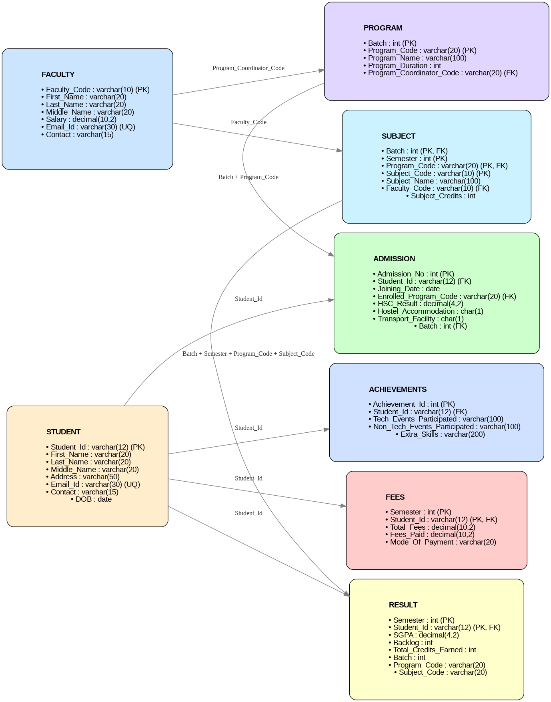
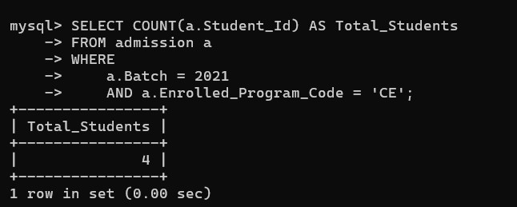
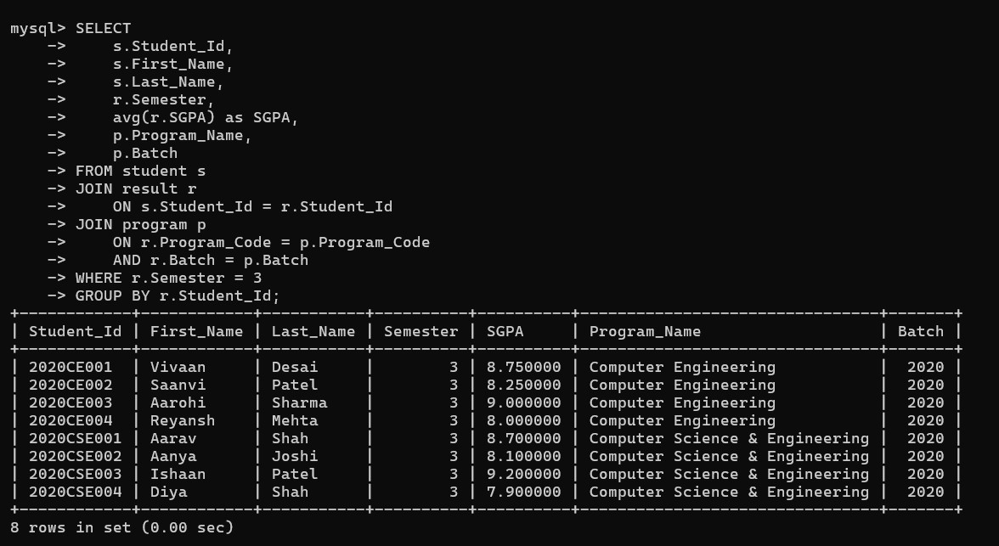

# STUDENT-DATABASE-SYSTEM

## 📌 Overview

The Student Database System is a relational database project designed to manage student information, admissions, academic performance, fees, faculty, subjects, and achievements.  
It demonstrates concepts like database design, constraints, normalization, and SQL queries to ensure data integrity and provide meaningful insights.  
 
## 🗂️ Project Structure
STUDENT_DATABASE_SYSTEM/  
│  
├─ database/  
│   ├─ schema.sql       # Database schema (tables, constraints)  
│   ├─ inserts.sql      # Sample data records  
│   └─ erd.png          # Entity-Relationship Diagram  
│  
├─ scripts/  
│   ├─ queries.sql      # Real-world SQL queries  
│   └─ screenshots/     # Query execution screenshots  
│  
└─ README.md            # Project documentation  


## 📊 ER Diagram
  

## ⚙️ Setup Instructions

#### 1. Clone the repository

```git clone https://github.com/khuc-tech/student_database_system.git```  
```cd student_database_system```

#### 2. Open MySQL and create a database

```CREATE DATABASE student_database_system;```  
```USE student_database_system;```

#### 3. Run the schema and inserts scripts

```SOURCE database/schema.sql;```  
```SOURCE database/inserts.sql;```

#### 4. Execute queries from queries.sql

```SOURCE scripts/queries.sql;```  


## 🔎 Sample Queries

Here are a couple of examples (full list in [Queries file](scripts/).):  

```sql  
-- Count number of students enrolled in each batch & program  
SELECT COUNT(a.Student_Id) AS Total_Students
FROM admission a
WHERE 
    a.Batch = 2021 
    AND a.Enrolled_Program_Code = 'CE';


-- Find the average SGPA of each student for Semester 3
SELECT 
    s.Student_Id, 
    s.First_Name, 
    s.Last_Name, 
    r.Semester, , 
    p.Batch 
FROM student s 
JOIN result r 
    ON s.Student_Id = r.Student_Id 
JOIN program p 
    ON r.Program_Code = p.Program_Code 
    AND r.Batch = p.Batch 
WHERE r.Semester = 3 
GROUP BY r.Student_Id;
```  
### 📷 Sample Outputs

You can find all screenshots in the [Screenshots Folder](scripts/screenshots/).  

Count number of students enrolled in each batch & program  
  

Find the average SGPA of each student for Semester 3  
  


### 👩‍💻 Author

##### KHUSHI PATEL  
📧 khushipatel1763@gmail.com
